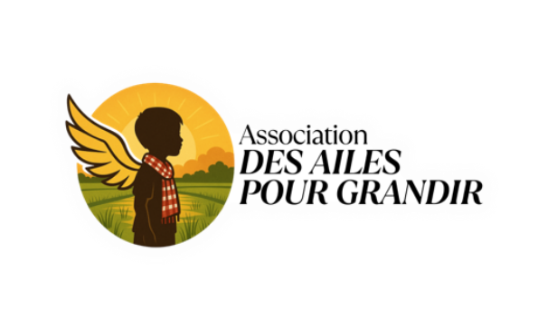

<p align="center">
  
</p>

<h1 align="center">Hope & Impact — Des Ailes pour Grandir</h1>
<p align="center">
  <strong>NGO Sponsorship & Donation Platform · Cambodia</strong><br>
  Built with Laravel · Tailwind CSS · Alpine.js
</p>

<p align="center">
  
  
  
  
</p>

---

## 📖 About the Project

**Hope & Impact** (originally *Des Ailes pour Grandir* — "Wings to Grow") is a full-stack NGO web platform supporting vulnerable children and families in Cambodia. The platform enables child and family sponsorships, donation project management, multilingual content, and a complete admin back-office.

> "Safeguarding every child's right to safety, dignity, and a future free from exploitation."

---

## ✨ Features

### 🌐 Public Site
- **Home page** — dynamic hero, stats, impact sections
- **Childhood pages** — Protection, Health & Nutrition, Education, Personal Development, Children's Homes
- **Family pages** — Housing & Family Stability, family listings with search & filter
- **Sponsor pages** — Browse children & families, filtered grid with pagination
- **Donation page** — HelloAsso embedded widget per project, campaign card modal
- **Fundraiser page** — Solidarity fundraiser guide with 6 campaign types
- **Multilingual** — FR / EN / KM (Khmer) via `data-fr/en/km` attributes + Google Translate integration
- **Particle animations** — Night sky → dawn canvas (stars, shooting stars, light rays) on key pages

### 🔐 Admin Panel
- **Dashboard** — live stats, recent activity
- **Children management** — CRUD with image upload, profile photo, sponsorship status
- **Family management** — CRUD, family members, documents, media
- **Sponsor management** — sponsor profiles, linked children & families
- **Donation projects** — CRUD with HelloAsso widget/vignette URL management, badge colors
- **Email management** — Trilingual email templates (account created, password reset), sponsor search, live preview, send
- **Settings** — `storage/app/settings.json` — site name, logo, favicon, meta tags, social links

### 💳 Sponsorship System
- Encrypted route IDs (`Crypt::encryptString`) for public URLs
- Sponsor ↔ Child (many-to-many via `sponsor_child`)
- Sponsor ↔ Family (many-to-many via `sponsor_family`)
- `PublicChildController` / `PublicFamilyController` — detail pages
- `SponsorController` — listing + sponsorship form pages

---

## 🏗️ Tech Stack

| Layer | Technology |
|---|---|
| Framework | Laravel 11.x |
| PHP | 8.5 |
| Database | MySQL 8.0 |
| CSS | Tailwind CSS (CDN) |
| JS | Alpine.js, Vanilla JS |
| Fonts | Cormorant Garamond, Outfit, Fraunces, Plus Jakarta Sans |
| Icons | Font Awesome 6 |
| Payments | HelloAsso (iframe embed) |
| Mail | Laravel Mailable + SMTP |
| Storage | Local (`public/uploads/`) |
| Dev environment | XAMPP (macOS Apple Silicon) |

---

## 📁 Project Structure

```
hope-laravel/
├── app/
│   ├── Http/
│   │   ├── Controllers/
│   │   │   ├── Admin/
│   │   │   │   ├── AdminEmailController.php
│   │   │   │   ├── ProjectAdminController.php
│   │   │   │   └── ...
│   │   │   ├── PublicChildController.php
│   │   │   ├── PublicFamilyController.php
│   │   │   └── SponsorController.php
│   ├── Mail/
│   │   ├── SponsorAccountCreated.php
│   │   └── SponsorPasswordReset.php
│   └── Models/
│       ├── Family.php
│       ├── FamilyMember.php
│       ├── SponsoredChild.php
│       ├── Sponsor.php
│       ├── DonationProject.php
│       └── ...
├── resources/views/
│   ├── layouts/
│   │   ├── app.blade.php
│   │   ├── header.blade.php
│   │   └── footer.blade.php
│   ├── pages/
│   │   ├── childhood/
│   │   │   ├── protection.blade.php
│   │   │   ├── health-nutrition.blade.php
│   │   │   ├── education.blade.php
│   │   │   ├── personal-development.blade.php
│   │   │   └── childrens-homes.blade.php
│   │   ├── families/
│   │   │   └── housing.blade.php
│   │   └── support/
│   │       ├── donate.blade.php
│   │       └── fundraiser.blade.php
│   ├── sponsor/
│   │   ├── index.blade.php
│   │   ├── children-show.blade.php
│   │   └── families-show.blade.php
│   └── admin/
│       └── emails/
│           └── index.blade.php
├── storage/app/
│   └── settings.json          ← site-wide settings
└── public/
    └── uploads/
        ├── children/           ← child profile photos
        ├── families/           ← family profile photos
        └── projects/           ← donation project images
```

---

## ⚙️ Installation

### Requirements
- PHP >= 8.2
- Composer
- MySQL 8.0
- Node.js (optional, for assets)

### Steps

```bash
# 1. Clone the repository
git clone https://github.com/your-org/hope-laravel.git
cd hope-laravel

# 2. Install dependencies
composer install

# 3. Copy environment file
cp .env.example .env

# 4. Generate app key
php artisan key:generate

# 5. Configure your .env
# DB_DATABASE=hope_laravel
# DB_USERNAME=root
# DB_PASSWORD=

# 6. Run migrations
php artisan migrate

# 7. Seed initial data (optional)
php artisan db:seed

# 8. Create storage directories
mkdir -p public/uploads/children
mkdir -p public/uploads/families
mkdir -p public/uploads/projects

# 9. Fix storage permissions (XAMPP / macOS)
chmod -R 775 storage bootstrap/cache
sudo chown -R $(whoami):staff storage bootstrap/cache

# 10. Serve the application
php artisan serve
```

---

## 🔑 Environment Variables

Key variables to configure in `.env`:

```env
APP_NAME="Hope & Impact"
APP_URL=http://localhost:8000

DB_CONNECTION=mysql
DB_HOST=127.0.0.1
DB_PORT=3306
DB_DATABASE=hope_laravel
DB_USERNAME=root
DB_PASSWORD=

MAIL_MAILER=smtp
MAIL_HOST=smtp.example.com
MAIL_PORT=587
MAIL_USERNAME=your@email.com
MAIL_PASSWORD=yourpassword
MAIL_FROM_ADDRESS=noreply@desailespourgrandir.org
MAIL_FROM_NAME="Des Ailes pour Grandir"
```

---

## 🗃️ Key Database Tables

| Table | Description |
|---|---|
| `sponsored_children` | Child profiles (name, code, country, story, photo, is_active) |
| `sponsors` | Sponsor profiles (name, email, country) |
| `sponsor_child` | Pivot: sponsor ↔ child |
| `families` | Family profiles (name, code, country, story, photo) |
| `family_members` | Members of a family (name, relationship, phone, email) |
| `sponsor_family` | Pivot: sponsor ↔ family |
| `donation_projects` | HelloAsso fundraising projects (title FR/EN/KM, widget URL) |
| `family_updates` | Field reports for families |

---

## 🖼️ Image Conventions

All images are stored in `public/uploads/` — **no Storage symlink required**.

```blade
{{-- Correct usage --}}
profile_photo) }}">

{{-- Fallback --}}
{{ $child->profile_photo ? asset($child->profile_photo) : asset('images/child-placeholder.jpg') }}
```

Upload path in controllers:
```php
$file->move(public_path('uploads/children'), $filename);
```

---

## 🌍 Multilingual Support

Pages support **French · English · Khmer** via inline `data-` attributes:

```html
<span
  data-fr="Accueil"
  data-en="Home"
  data-km="ទំព័រដើម">Home</span>
```

Language is applied via JavaScript:
```js
window.applyPageLang = function(lang) {
    document.querySelectorAll('[data-fr],[data-en],[data-km]').forEach(el => {
        const val = el.getAttribute('data-' + lang);
        if (val !== null) el.innerHTML = val;
    });
};
```

---

## 🎨 Design System

| Element | Value |
|---|---|
| Primary color | `#f97316` (orange) |
| Accent | `#f59e0b` (amber) |
| Admin navy | `#0f172a` |
| Primary fonts | Cormorant Garamond, Fraunces |
| Body fonts | Outfit, Plus Jakarta Sans, DM Sans |
| Icon library | Font Awesome 6 |
| Settings path | `storage/app/settings.json` |

---

## 🔒 Security

- Route IDs are encrypted with `Crypt::encryptString()` — IDs are never exposed in URLs
- Admin routes protected by auth middleware
- Image uploads validated by MIME type and extension
- All user input passed through `e()` / `Str::limit()` in Blade

---

## 📄 License

This project is open-sourced software licensed under the [MIT license](https://opensource.org/licenses/MIT).

---

<p align="center">Built with ❤️ for the children of Cambodia · <a href="https://www.desailespourgrandir.org">desailespourgrandir.org</a></p>